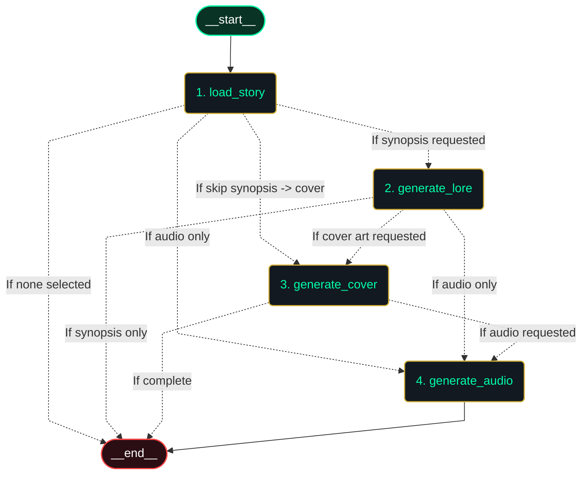
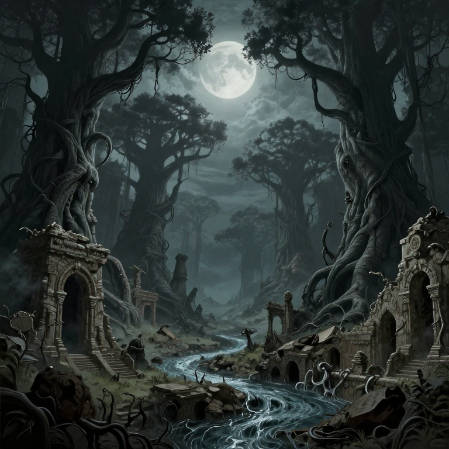

# 🌌 H. P. Lovecraft Multimodal Studio

An end-to-end multimodal suite for exploring, illustrating, and listening to the complete fiction of **H. P. Lovecraft**:
- **🔮 LangGraph Orchestration Engine**: Stateful Directed Acyclic Graph (DAG) managing pipeline flow, conditional branching, checkpointer caching, and real-time intra-node streaming.
- **68 Tales Collection**: Clean Markdown transcripts scraped from *hplovecraft.com*.
- **Ollama AI Lore & Synopsis**: Automatic atmospheric summaries and cover art prompts using `gemma4:e2b`.
- **Gothic Cover Art Generation**: Quantized `Z-Image-Turbo` (int8) diffusion model generating 768×768 cover illustrations.
- **Vincent Price Audiobook Narration**: Zero-shot voice cloning using `CosyVoice3` with smart zero-overlap sentence chunking and natural pause pacing.
- **The Necronomicon Vault Web Studio**: Custom Gothic web app (FastAPI) streaming LangGraph execution with real-time logs via Server-Sent Events (SSE).

---

## 🔮 LangGraph Workflow & DAG Architecture

The entire multimodal pipeline is structured as a stateful graph in [`studio_graph.py`](studio_graph.py):



### Graph Capabilities:
- **`StudioState` Management**: Keeps state for text chunks, Ollama prompts, generated image paths, audio paths, and log buffers.
- **Conditional Branching**: Dynamically skips nodes depending on which components are enabled in the UI.
- **Memory Checkpointing (`MemorySaver`)**: Thread-safe caching and session state tracking.
- **Real-Time Intra-Node Callbacks**: Streams progress for each diffusion step and audio chunk immediately to the UI via `RunnableConfig` queue dispatchers.
- **Visual DAG Inspector**: View the live rendered diagram at `http://127.0.0.1:8000/api/graph/dag` or in [`results/langgraph_dag.png`](results/langgraph_dag.png).

---

## 🌟 Multimodal Showcase: *Memory (1919)*

Here is an example of the full multimodal pipeline running on Lovecraft's prose poem **"Memory"**:

| Component | Output & Details |
| :--- | :--- |
| **📖 Original Story** | [`tales/memory.md`](tales/memory.md) (1,982 chars, ~390 words) |
| **🖼️ Gothic Cover Art** | <br><sub>**Model:** Z-Image-Turbo (int8) • **Resolution:** 768×768 px</sub> |
| **🎙️ Cloned Audiobook** | 🎧 **Master WAV:** [`results/memory.wav`](example/memory.wav)<br>• **Narrator:** Vincent Price (zero-shot clone via CosyVoice3)<br>• **Duration:** `2m 54s` (24 kHz stereo WAV)<br>• **Structure:** 11 sentence chunks with 350ms sentence pauses & 800ms paragraph pauses |
| **📜 AI Lore & Synopsis** | *"In the accursed valley of Nis beneath a dying moon, a Genie questions the Daemon of the Valley regarding the ruins of forgotten palaces. The Daemon, who is Memory itself, dimly recalls the extinct builders whose brief existence resembled the flowing river Than, naming them 'Man' before turning to watch a solitary ape in the crumbling courtyard."* |
---

## 📁 Repository Structure

```
lovecraft-tales/
├── studio_graph.py                 # 🔮 LangGraph Stateful Workflow Engine (Nodes & Routing)
├── web_app.py                      # 🌌 The Necronomicon Vault (FastAPI + LangGraph Web UI)
├── app.py                          # 🌌 Unified Gradio Studio (Alternative UI)
├── generate_audio.py               # 🎙️ Audiobook generation CLI tool (CosyVoice3 + Vincent Price)
├── generate_image.py               # 🖼️ Cover art generation CLI tool (Z-Image-Turbo 768x768)
├── scrape_tales.py                 # 📜 Scraper for all 68 tales from hplovecraft.com
├── main.py                         # 🎙️ Standalone CosyVoice voice cloning UI
├── z_image_app.py                  # 🖼️ Standalone Z-Image Gradio generator UI
├── z_image_test.py                 # 🧪 Standalone test script for Z-Image
├── playground.ipynb                # 📓 Jupyter notebook for RAG & token analysis
│
├── tales/                          # 📖 68 Lovecraft Fiction Tales (.md format)
│   ├── dagon.md
│   ├── memory.md
│   ├── the_call_of_cthulhu.md
│   ├── at_the_mountains_of_madness.md
│   └── ...
│
├── results/                        # 🎧 Output master audiobooks and chunk WAVs
│   ├── memory.wav                  # Master audiobook for Memory (2m 54s)
│   ├── memory_cover.png            # 768x768 Cover Art for Memory
│   └── memory/                     # Individual chunk WAV files (resumable)
│
├── z_image_gradio_output/          # 🖼️ Output generated cover art PNGs
│   └── memory/                     # Timestamped Z-Image generation artifacts
│
├── Vincent Price Voice.mp3         # 🗣️ Reference audio for voice cloning
├── Vincent Price Voice_transcript.txt  # 📝 Cached reference audio transcript
│
├── models/                         # 🧠 Local Model Weights (gitignored)
│   ├── Fun-CosyVoice3-0.5B-2512/   # CosyVoice3 TTS weights
│   ├── Z-Image-Turbo/              # Z-Image base pipeline
│   └── Z-Image-Turbo-Quantized/    # Z-Image int8 safetensors
│
├── CosyVoice/                      # 📦 Vendored CosyVoice engine (gitignored)
├── LightX2V/                       # 📦 Vendored LightX2V diffusion engine (gitignored)
├── windows-procedure.md            # ⚙️ Windows CUDA/PyTorch setup guide
├── requirements.txt                # 📋 Python package requirements
└── README.md                       # 📘 Documentation
```

---

## 🚀 Quickstart & Usage

### 1. The Necronomicon Vault (Custom Gothic Web App) ⭐

Run the custom, immersive Lovecraftian-themed web application:

```powershell
# 1. Start Ollama (in a separate terminal)
ollama serve

# 2. Launch the Necronomicon Vault Web App
conda activate lovecraft
python web_app.py
```
Open **`http://127.0.0.1:8000`** in your browser to experience:
- **Atmospheric Gothic Aesthetic**: Obsidian & emerald abyssal styling, floating cosmic mist particle canvas, and vintage typography (`Cinzel`, `Crimson Pro`).
- **The Grimoire**: Interactive searchable catalogue of all 68 Lovecraft fiction stories with instant reader modal.
- **The Alchemical Studio**: Generate Ollama synopses, 768×768 Z-Image-Turbo cover art, and Vincent Price audiobooks with a single click.
- **Occult Terminal**: Live streaming execution logs (via Server-Sent Events) showing real-time step and chunk progress.

---

### 2. Gradio Studio (Alternative UI)

You can also run the Gradio interface:

```powershell
conda activate lovecraft
python app.py
```
Available at **`http://127.0.0.1:7860`**.

---

### 2. Batch Audiobook Generator CLI

Generate audiobooks for specific tales or the entire collection:

```powershell
conda activate lovecraft

# Generate a single tale (e.g. Memory or Dagon)
python generate_audio.py --tale memory

# List all 68 available stories
python generate_audio.py --list

# Batch generate all 68 tales
python generate_audio.py --all

# Test first 3 tales
python generate_audio.py --all --limit 3
```

---

### 3. Cover Art Generator CLI

Generate 768×768 gothic illustrations directly in the `z-image` environment:

```powershell
conda activate z-image
python generate_image.py --prompt "Gothic oil painting of ancient ruins in the valley of Nis under a waning moon" --output "results/memory_cover.png" --width 768 --height 768 --steps 8
```

---

### 4. Tale Scraper

To refresh or re-download the 68 tales from *hplovecraft.com*:

```powershell
conda activate lovecraft
python scrape_tales.py --output-dir tales
```

---

## 🐍 Conda Environments Reference

| Environment | Python Version | Primary Purpose | Key Packages |
| :--- | :--- | :--- | :--- |
| **`lovecraft`** | Python 3.10 | CosyVoice3 TTS, Whisper, App UI, Scraper | `torch 2.13`, `torchaudio 2.11`, `transformers==4.51.3`, `gradio`, `openai`, `beautifulsoup4` |
| **`z-image`** | Python 3.12 | Z-Image-Turbo Diffusion | `torch 2.11+`, `torchao`, `diffusers`, `lightx2v` |

---

## ⚖️ License & Attribution
- Stories by **H. P. Lovecraft** (Public Domain).
- Audio synthesis powered by **FunAudioLLM CosyVoice3**.
- Image synthesis powered by **LightX2V / Z-Image-Turbo**.
